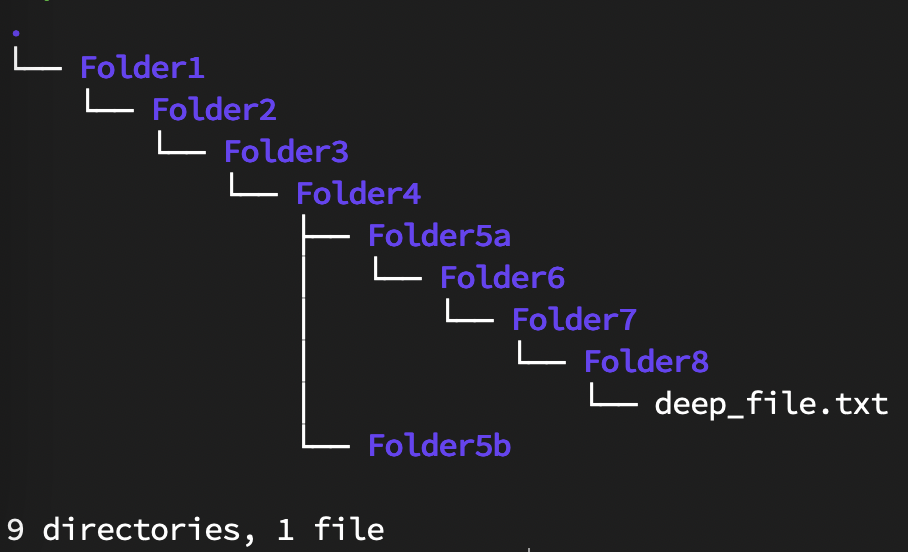

# MySQL Scripts:
The below are MySQL scripts and a program to run them that are in the utilities folder. When testing, use the following scripts to setup the database with the necessary data to mockup a real user's file system.

## runSQLScripts
This a simple script which will provide quick switching between different mocked file systems.
This is made so that backend and frontend developers can easily test their code and demo it using a simple interface.

### How to use:
```usage: test_fs_data.py [-h] [-n NAME] [-s SPECIFIC] [-v]

Script for running SQL scripts for filesystem mocking

options:
  -h, --help            show this help message and exit
  -n NAME, --name NAME  quick usage scripts such as simple, deep, and normal
  -s SPECIFIC, --specific SPECIFIC
                        specific script in utilities
  -v, --verbose         verbose output (only works with -n)
  ```
- Make sure to use within the utilities directory
- run an ssh tunnel using the following command:
    - ```ssh USERNAME@cs506-team-04.cs.wisc.edu -L localhost:5066:localhost:5066```
- install the necessary packages:
    - mysql-connector-python==8.2.0
    - mysql-connector-python-rf==2.2.2

## Script Explanations:
### clearTables:
This script will delete all the tables with their associated date contained within.

### createTables:
This will create the tables necessary for the File System, namely Group, User, Directory, and File.

### createUserGroup:
This will create some create some users and groups and enter it into their respective tables.

### mockData:
a more complicated file system tree


### mockDataSimple:
a simpler file system tree


### mockDeepTree:
more deep file system tree

